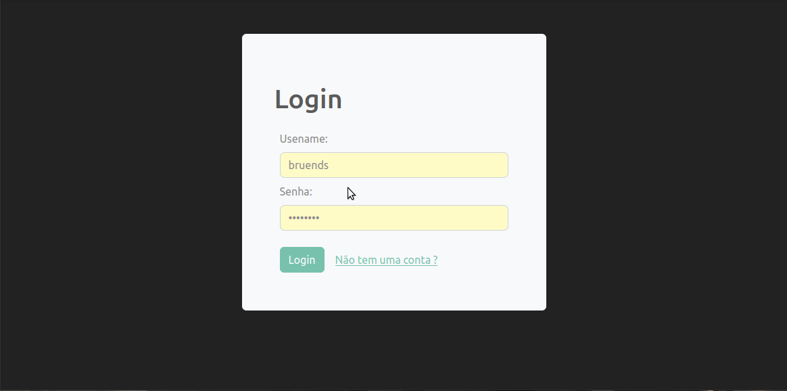

# Courses APP
An app to keep track of your EAD courses.



## Features
- Login / Register
- CRUD operations Via REST
- Routes
- Protected Routes 
- Auth via JWT
- State management with Redux

## Techs
- React
- React Router
- React Bootstrap
- Redux / React Redux
- Toastr


## install and Run

- install one of the apis  
[PHP Version](https://github.com/Bruends/courses-php-api)
or
[NodeJS Version](https://github.com/Bruends/courses-app-api)


- clone the repo

- intall the dependencies
```
npm install
```
- run the app
```
npm start
```
- the app will run on `localhost:3000`
